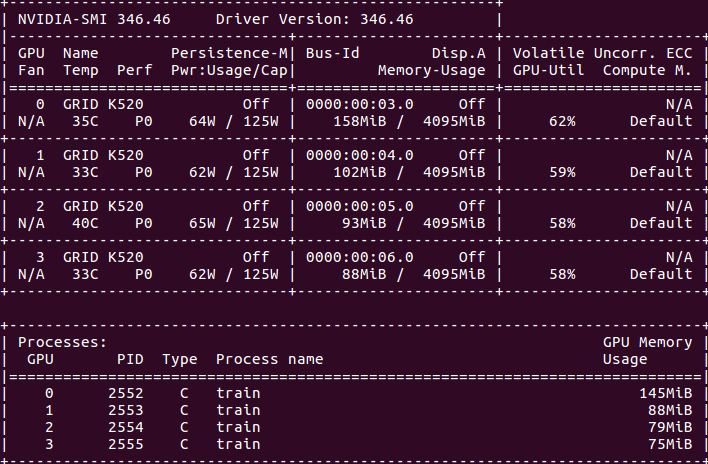
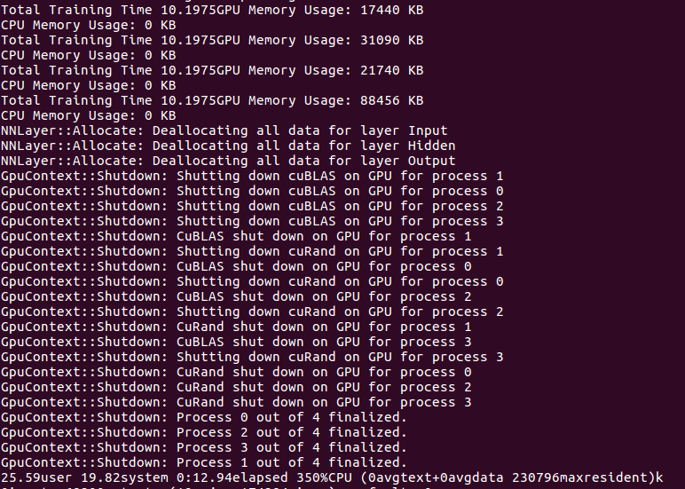
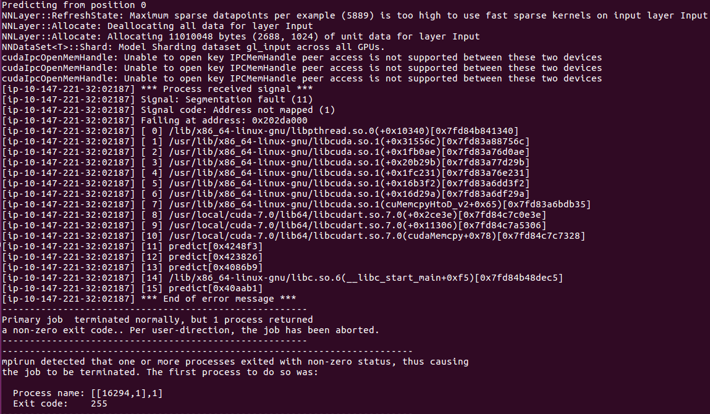

# beeva-poc-DSSTNE

## Multi-GPU tests

Experiment with g2.2x and g2.8x to check multi-gpu behaviour of Amazon DSSTNE

#### Experiment
Run scripts [run_100k.sh](run_100k.sh) and [run_10m.sh](run_10m.sh)
by modifying `train` with command `mpirun -np 4`

#### Results

* Train

* Predict

| dataset | instance | training time 
| ---- | ---- | ---- 
| Movielens 10M | g2.2x | 19.84s 
| Movielens 10M | g2.8x | 10.19s 
| Movielens 100k | g2.2x | 0.201s
| Movielens 100k | g2.8x | 0.149s 

##### Conclusions

- Amazon DSSTNE supports multi-gpu `train` with mpirun. 
- Training times with g2.8x (4gpu) are 2x shorter than g2.2x (1gpu)
- Amazon DSSTNE does not support by default multi-gpu `predict`.
- Amazon DSSTNE could support multi-gpu train and predict by using [Spark and ECS on AWS ](https://aws.amazon.com/es/blogs/big-data/generating-recommendations-at-amazon-scale-with-apache-spark-and-amazon-dsstne/).

